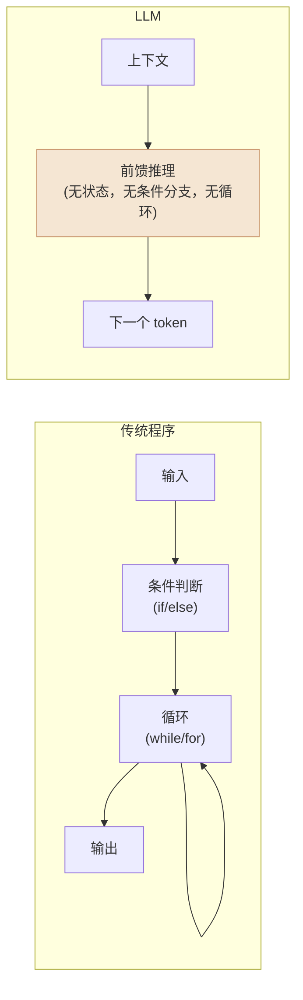
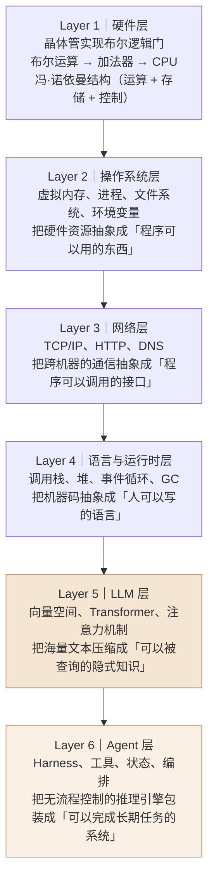
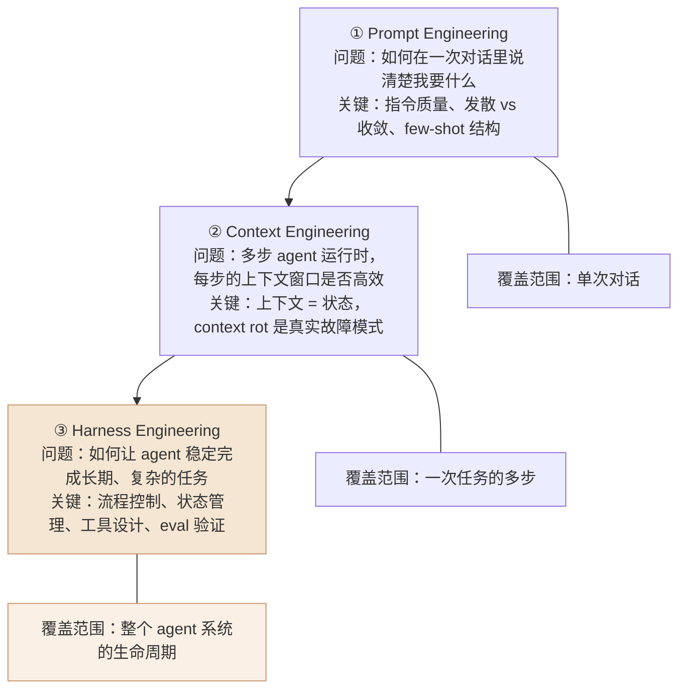
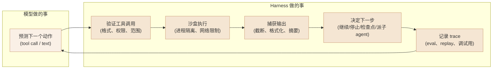
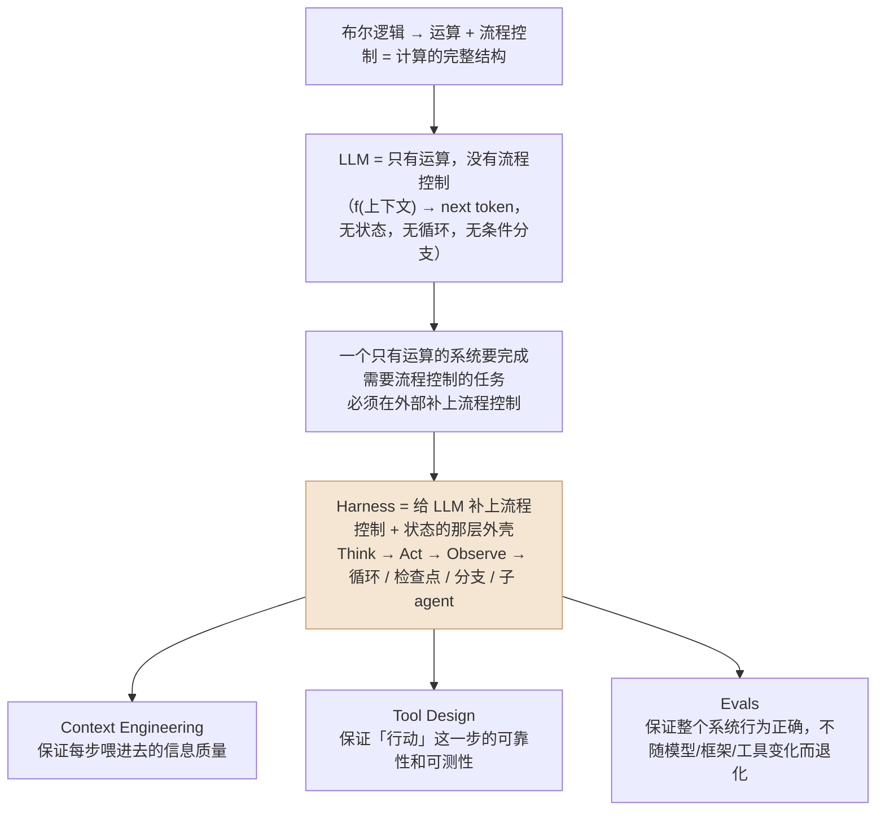
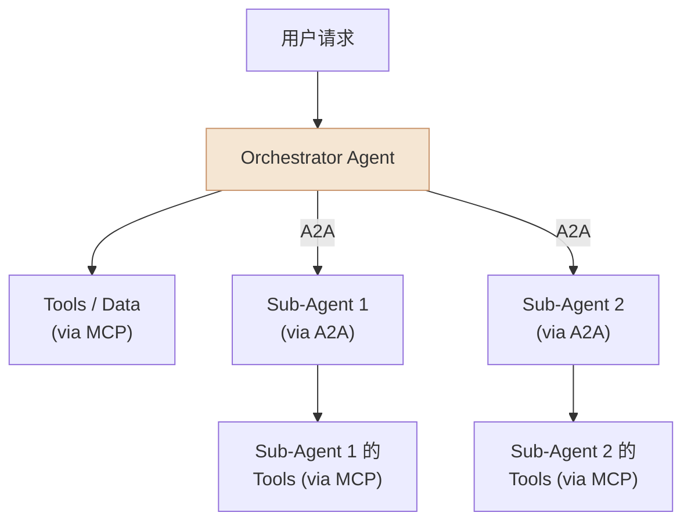
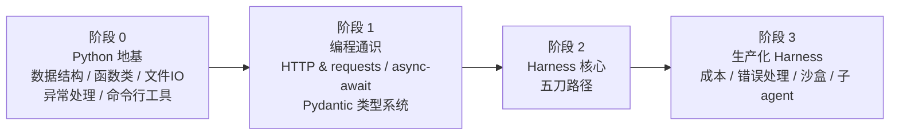

最近在读李笑来的《自学是门手艺》，他写了一段让我停下来反复想的话：

> 计算机之所以可以做流程控制，是因为它可以做布尔运算。从结构上看，一切计算机程序，都由且只由两个最基本的成分构成：运算（Evaluation）和流程控制（Control Flow）。

从 0 和 1，到 AND / OR / NOT，到条件判断和循环，再到你现在用的每一个 app——整条链路都从这里出发。

读完这段话，我脑子里转出一个问题：

**如果运算 + 流程控制 = 一切程序，那 LLM 呢？**

这个问题的答案，后来成了我理解整个 AI 工程认知框架的一把钥匙。

---

## 写在前面：这篇文章给谁看

给**非科班背景、和 AI 深度协作做事的人**——不需要从头学计算机科学，但需要一张"地图"，知道哪些概念值得深挖、哪些仅作了解、哪些直接跳过。

文章由三部分组成：
1. **原理层**：从布尔逻辑出发，推导出 LLM 的本质局限，以及 Harness Engineering 为什么是那个补丁
2. **全景层**：2026 年 AI Agent 工具和概念的优先级地图（经联网验证）
3. **路径层**：针对非科班、以 harness 为核心的具体学习路线

---

## 一、LLM 是一台纯运算机器

回到那个问题：LLM 有运算，那它有流程控制吗？

答案是**没有**——至少在模型本身的层面是没有的。

LLM 的推理过程可以用一个函数表达：

```
f(上下文) → 下一个 token
```

它不维护内部状态，不能执行 `while` 循环，不能做 `if/else` 条件分支，不能记住上一次对话里说了什么。每次调用都是全新开始：你把上下文（包括你的问题、历史对话、工具定义等）全部塞进去，它根据这些内容预测下一个词元，然后把这个词元追加进去，再预测下一个，以此类推。

更精确地说，这个函数是一个**前馈神经网络**（Feedforward Neural Network）。前馈的意思是信息只朝一个方向流动——从输入到输出，中间不存在反馈回路。

这和李笑来描述的"能做流程控制的程序"有一个根本差异：



你现在看到 AI 在"循环"——比如 Claude Code 一个任务跑 30 步——那个循环**不在模型里**，在包裹模型的那层代码里。模型只管每步预测，循环逻辑由外面的程序控制。

这个差异不是技术细节，它是整个 AI 工程的根本结构。

---

## 二、从布尔逻辑到 Agent：六层认知地图

理解了 LLM 的本质之后，整个计算世界的层级就能从第一原理出发连成一张地图：



**对非科班、目标是做 agent 的人，这六层的学习投入应该是倒三角的：**

| 层级 | 最小识字需求 | 投入比例 |
|---|---|---|
| Layer 1 硬件 | 知道布尔逻辑是 0/1 + AND/OR/NOT，知道 CPU 执行指令 | 1% |
| Layer 2 OS | **进程是什么、文件系统怎么用、环境变量是什么**——影响每天写代码 | 10% |
| Layer 3 网络 | **HTTP 请求/响应结构、JSON、端口号**——影响每个 API 调用 | 10% |
| Layer 4 运行时 | **调用栈 + async 事件循环**——理解为什么 agent 代码到处是 `await` | 20% |
| Layer 5 LLM | **上下文窗口、tokenization、KV Cache**——理解 harness 设计的约束来源 | 20% |
| Layer 6 Agent | **Harness 所有原语**——这是目标层 | 40% |

为什么 Layer 4 的 async 事件循环要单独强调？因为大量 agent 代码是异步的——工具调用、模型调用、文件操作全都可以并发。如果没有事件循环的心智模型，你会看不懂代码里的 `async def`、`await`、`asyncio.gather()`，也不知道为什么并发工具调用可以大幅提速。

---

## 三、三层工程：Prompt → Context → Harness

理解了 LLM 没有流程控制，就能理解 AI 工程里三层能力为什么是这个结构：



这三层不是独立的——每一层都以下面一层为基础，并且解决的问题比下面一层更大。

### 3.1 Prompt Engineering：输入质量决定输出空间

Prompt engineering 已经是共识能力，这里只强调两个在 agent 场景里特别重要的点：

**结构化分隔符**让 attention 有清晰边界。`<context>`、`<task>`、`<output>` 这类标签，或者 Markdown 标题，等于给模型的注意力机制提供路标。

**信息位置很重要**。Liu et al. (2023) 在 *Lost in the Middle* 论文里测量了模型对不同位置信息的利用率，结果是 U 型曲线：开头和结尾利用率最高，中间显著下降。在多步 agent 任务里，如果"关键约束"放在第 5 条 message，跑到第 20 步时它已经埋进中间地带，attention 利用率会显著下降。**关键约束放 system，关键结果放最近的 turn。**

### 3.2 Context Engineering：上下文就是状态

这是从单步 prompt 到多步 agent 的关键升级。

[上一篇文章](/writing/prompt-600ms/) 里详细讲了 KV Cache 的机制——这里直接用那些结论：**每一步的 prefill 成本是 O(N²)，当上下文越来越长，每步成本以平方速度增长；attention 对中间内容有衰减（Lost in the Middle 现象）；cache 命中要求前缀逐字节不变。**

这三个底层约束，推导出 context engineering 的三条原则：

**原则一：Cache-First Layout。** 把每步的 prompt 分成永远稳定的前缀（system 提示、工具定义、项目规则）和每步变化的后缀（当前消息、当前工具结果）。前缀稳定 → cache 命中 → 每步只按读取折扣计费，而不是全价 prefill。常见的反模式是在 system 里塞 `当前时间：2026-06-02 11:30:21`——每分钟都会 cache miss。

**原则二：信息要么在头（system），要么在尾（最近 turn）。** 中间的内容主动压缩摘要或丢弃，不要原文堆积。否则到第 30 步，你在第 5 步写的"必须用 TypeScript"已经沉进了 attention 衰减区。

**原则三：状态写文件。** context 是 O(N²) 成本且有衰减；文件只有在需要时才读进来占用 context。长任务的进度、已完成的子任务结果、关键决策，写 `PROGRESS.md`，按需读取，而不是让 agent "凭记忆"在长 context 里翻找。

**"Context rot"** 是真实的生产故障模式，不是比喻——Chroma 的研究量化了这个现象：随着输入 token 增长，所有主流模型的推理质量都有可测量的下降。一个实际的测试：打开任何一个 agent 的完整 trace 日志，对比第一步和第七步的上下文，数一数有多少 token 已经对当前步骤毫无贡献。第一次做这个实验会让人感到不舒服，然后会去把它修好。

### 3.3 Harness Engineering：给 LLM 补上它缺少的那一半

这是三层里级别最高、杠杆最大，也最被低估的一层。

一个 harness 在每个 agent step 里实际做的事：



模型只做了一件事：预测下一步行动。其余的——执行、验证、状态管理、错误恢复、记录——都是 harness 的工作。

Alice Labs 2026 年的 agent 框架报告中有一组数据：**企业 AI 系统 65% 的失败案例追溯到 Harness Defects（上下文漂移、状态退化、工具模式错位），而不是模型能力不足。** 换模型很少是解法，修 harness 才是。

用 claude code，cursor，aider 这类工具时，你正在用的就是工业级 harness 的一部分。它们在每步帮你管理 context 压缩、工具执行、错误恢复、子 agent 调度——这些你通常察觉不到，但它们是让 AI 能"稳定工作几小时"而不是"跑十步就崩"的根本原因。

---

## 四、第一原理推导：为什么 Harness 是必然的

现在可以把这几个层串起来：



这不是比喻。一台计算机能做流程控制，是因为硬件层上有条件跳转指令（`JMP`、`JNZ`）——这些指令让布尔值能够改变程序执行的方向。LLM 的推理过程里没有等价的机制，每次调用都是无记忆的前向通过（forward pass）。

所以 Harness 不是锦上添花的工程优化，它是让 LLM 做有用的事的**必要基础设施**。

---

## 五、2026 年 Agent 工程全景：什么值得学，什么跳过

> 以下评估基于 Rohit (@rohit4verse) 在 2026 年 4 月发表的 [What to Learn, Build, and Skip in AI Agents](https://x.com/rohit4verse/status/2049548305408131349)，经过 2026 年 6 月的联网独立验证。

### 5.1 必须掌握的原语（半衰期 3 年以上）

这些是在框架、模型、工具不断换代的情况下，仍然复利的概念：

**Context Engineering** — 上下文就是状态。管理 context 的方式决定 agent 的可靠性上限。Chroma 的 context rot 研究已经量化了这个现象，是生产级失败的主要来源之一。

**Tool Design** — 5 到 10 个命名良好的工具（英语动词短语命名）好过 20 个平庸的工具。**错误信息是 tool design 里最被忽视的杠杆**：一条错误信息能让模型明白"怎么改"和只说"Error 400"之间，retry loop 次数差 3 到 5 倍，直接影响成本。

**Orchestrator-Subagent 模式** — 默认单 agent，只有在三种情况下才用多 agent：上下文压力超过窗口上限、需要并行执行异构任务、子任务高度独立且重复。子 agent 只读，主 agent 拥有写状态的权限。天真并行（多个 agent 写共享状态）在 demo 里好看，在生产里必崩。

**Evals + Golden Datasets** — 这是整个领域里最高杠杆、最被低估的能力。Spotify 工程团队公开报告他们的 LLM-as-judge 层拦截了约 25% 的错误 agent 输出。没有 eval 的团队在模型版本更新、工具接口变化、框架升级时全靠运气——有 eval 的团队用数据做决策。**第一天就建 50 个手标例子**，主观部分用 LLM-as-judge，客观部分用 exact-match 或程序化检查。

**MCP（Model Context Protocol）** — 已成为 model ↔ tools/data 的行业标准协议。截至 2026 年 6 月，月 SDK 下载量超过 9700 万次，注册服务器超过 9600 个，所有主流模型提供商（Anthropic、OpenAI、Google、Microsoft）全部支持，由 Linux Foundation 下的 AAIF 托管。

**A2A（Agent-to-Agent Protocol）** — 这是 Rohit 原文的重要遗漏。MCP 是垂直协议（model ↔ tools），A2A 是水平协议（agent ↔ agent）。Google 2025 年 4 月发布，2026 年初到 v1.0，150+ 组织采用，同样由 AAIF 托管。生产多 agent 系统通常**同时使用 MCP 和 A2A**：



**Sandboxing** — 永远不要在无隔离环境里跑 agent 生成的代码。进程隔离 + 网络出口控制 + 密钥作用域边界，这不是安全加分项，是基线要求。任何 agent 都可能被间接注入（prompt injection），沙盒是兜底。

### 5.2 工具选型（2026 年 6 月，经验证）

**编排框架**

| 工具 | 适用场景 | 生产验证 |
|---|---|---|
| **LangGraph** | 默认选择，复杂有状态 agent | 月下载量 9000 万，Uber/JPMorgan/BlackRock 在用 |
| **Pydantic AI** | Greenfield + 强类型 + Python 类型安全 | 2025 年底到 v1.0，活跃增长中 |
| **Mastra** | TypeScript 生态 | TS 生态的事实标准 |
| **CrewAI** | 快速原型（2 到 4 小时出来）| 别把它当生产基础——产品化前迁移 LangGraph |

注意：原文把 CrewAI 判断为"不要用于生产"过于绝对——它每日仍有 1200 万次执行量，v1.10.1 支持 MCP 和 A2A。真实模式是：CrewAI 原型 → 产品化时迁移 LangGraph。

**可观测性**

发布之前先接可观测性，这是不可跳过的步骤：

- **Langfuse**：OSS 默认，自托管，MIT 许可，覆盖 tracing + prompt 版本管理 + LLM-as-judge eval
- **LangSmith**：LangChain/LangGraph 生态绑定更紧
- **Braintrust**：研究型 eval 工作流，需要严格对比

**沙盒运行时**

- **E2B**：通用沙盒代码执行，SDK 简洁
- **Browserbase + Stagehand**：浏览器自动化
- **Modal**：短时爆发计算

### 5.3 跳过清单（附理由）

| 工具/概念 | 为什么跳过 |
|---|---|
| AutoGen / AG2 | 微软已宣布进维护模式，新功能移到 Microsoft Agent Framework；AG2 社区 fork 活跃但受众有限 |
| Semantic Kernel | 除非深度绑定微软企业栈 |
| "Autonomous agent" 叙事 | AutoGPT/BabyAGI 这类"部署后自主运行"的产品形态在 2026 年已经死亡，行业收敛到"supervised，bounded，evaluated" |
| Agent 应用商店 | 企业不买通用预制 agent，买垂直 agent 或自建 |
| SWE-bench / OSWorld 排行榜 | Berkeley 研究记录了这些基准可以被刷榜而不解决底层任务；内部 eval 才是真信号 |
| 天真并行多 agent | 共享可写状态的并行架构在生产里必崩，这不是工程难度问题，是状态一致性的数学问题 |
| 本周 HN 上的新框架 | 等六个月。等六个月后如果它还重要，会更清楚；如果不重要，你省了一次迁移 |

**五条过滤测试**（在采用任何新工具/框架之前过一遍）：

1. 两年后还重要吗？原语（协议、模式、基础设施抽象）的半衰期是年，封装层的半衰期是月
2. 你尊敬的工程师在它上面做了真实的东西，并诚实地写出来了吗？带数字的 postmortem 胜过十篇发布公告
3. 采用它需要扔掉现有的 tracing / auth / retry / config 吗？"要做平台的框架"的死亡率超过 90%
4. 跳过它六个月的代价是什么？大多数时候答案是零
5. 你能测量它对你的 agent 是否真的有帮助吗？没有 eval 就是凭感觉

---

## 六、非科班的五刀学习路线

> 针对的状态：Python 基础进行中，目标是能做 agent、能读懂 harness 代码、能定位生产失败。



阶段 2 的五刀，是整个路线里最关键的部分，值得展开：

### 第一刀：理解 Anthropic SDK，读懂消息结构

把 Anthropic docs 的 Tool use 章节从头到尾过一遍。重点不是会调用，而是能回答这几个问题：

- `messages` 数组里的 `system` / `user` / `assistant` 各代表什么？
- `tool_use` 消息是什么格式？`tool_result` 是什么格式？
- streaming 和非 streaming 的区别在哪里？
- prompt caching 的 `cache_control` 字段加在哪里？为什么要加？

理解消息结构，才能真正理解后续每一步 harness 在做什么。

### 第二刀：不用框架，手写一个 Think-Act-Observe 循环

这一刀**不能用 LangGraph**，必须裸 Python + Anthropic SDK。

目标是写一个能跑 3 到 5 步工具调用的最简 agent：

```python
while step < max_steps:
    response = client.messages.create(...)   # Think
    if tool_call := extract_tool_call(response):
        result = execute_tool(tool_call)     # Act
        messages.append(tool_result(result)) # Observe → 下一次 Think
        # 把状态写到文件，不只是放在内存
        save_state(messages, step)
    else:
        break  # 没有工具调用，任务完成
```

为什么必须手写一遍？因为 LangGraph 把这个循环抽象成了 Graph / Node / Edge，如果你从没有手写过，就不知道框架在抽象什么、不知道出了问题去哪里调试、不知道状态在哪里可能泄漏。手写之后再看 LangGraph，你会发现每个抽象都有它对应的理由。

### 第三刀：LangGraph——用框架管理状态和检查点

手写 loop 之后，LangGraph 里的每个概念都有对应的感知：

- **TypedDict State**：就是你手写时的 `messages + step + 自定义状态`，只是被类型化了
- **Node**：就是你手写时的每一段逻辑，被拆成了有名字的函数
- **Conditional Edge**：就是你手写时的 `if tool_call else break`，只是被显式画出来了
- **Checkpoint**：就是你手写时的 `save_state()`，只是内置支持了数据库后端

重点学：Checkpoint 机制。它解决的是"agent 中途崩掉，能不能从上次的进度恢复"——这是生产 agent 的基本要求。

### 第四刀：可观测性 + Evals，在发布之前必须接上

**Langfuse 接入：** 只需要几行代码，本地用 Docker 自托管，能看到每次 agent 运行的完整 trace（每步的输入 context、模型输出、tool call、延迟、token 数）。

**手标 golden examples：** 在接下来一周用你的 agent 时，把每一次失败的 case 标下来，建成 50 个例子。这 50 个例子是你未来所有改动的回归测试基准。不需要复杂的框架——一个 JSON 文件 + 一段 Python 脚本就够。

**LLM-as-judge：** 主观任务（"这个输出好不好"）让一个模型来评判，而不是人工逐一看。用 Claude 当评判者，给它一个结构化的评分 prompt，定义清楚什么是好的、什么是不够的，让它输出 `{score: 1-5, reason: "..."}`。

### 第五刀：MCP 实践——理解协议的概念模型

MCP 的关键不在于会调用，在于理解它的概念模型：

- **Resources**：agent 可以读取的静态内容（文件、数据库记录、API 响应）
- **Tools**：agent 可以执行的动作（写文件、调 API、搜索）
- **Prompts**：可复用的 prompt 模板
- **Transport**：stdio（本地进程通信）or HTTP SSE（远程服务）

实操建议：先**跑一个现成的 MCP server**（Filesystem server 是最简单的起点，可以在 Claude Code 里直接用），观察 inspector 里的消息格式；然后**写一个最简单的自定义 MCP server**，把你已有的一个工具暴露出来。

---

## 七、信息源：周五 30 分钟够了

在一个每周都有新发布的领域，信息过载是真实威胁。这里只列经过验证的核心信息源：

| 信息源 | 更新频率 | 适合获取 |
|---|---|---|
| [Simon Willison's Weblog](https://simonwillison.net) | 日更 | 工具发布的最快一手实测 notes |
| [Latent Space](https://latent.space) | 周更 | AI 工程深度采访，行业叙事，不只是公告 |
| [Anthropic Engineering Blog](https://www.anthropic.com/engineering) | 不定期 | 官方 agent 架构、evals、harness 设计文章 |
| [Artificial Analysis](https://artificialanalysis.ai) | 持续 | 独立模型评测，不受厂商影响 |
| [awesome-harness-engineering](https://github.com/ai-boost/awesome-harness-engineering) | 社区维护 | harness 相关工具、模式、文章的索引 |

**周五 30 分钟流程**：Simon Willison（本周实测了什么新工具）+ Latent Space（本周深度内容）+ Anthropic Engineering（有无新文章）。其余跳过。

**养成一个判断新工具的习惯**：看到新发布时，写下"六个月后我要看到什么才相信它重要"，然后回来核对。大多数时候问题会自己回答。

---

## 写在最后

从 0 和 1 出发，通过布尔运算和流程控制，人类建起了所有的软件。现在，这个结构里出现了一个新的节点——一台只会做运算、不会做流程控制的巨大函数。

围绕它的工程学，本质上是一件古老的事：**给一个计算元件补上它缺少的结构，让它能够完成复杂的任务。** 这和当年操作系统工程师给 CPU 补上进程管理和内存抽象，是同一类工作，只是场景和工具不同。

理解这个结构，不只是为了做好 agent——它帮你理解为什么某种 prompt 写法管用、为什么某个工具设计会让模型 retry 5 次、为什么某个 agent 越跑越笨。理解底层，是判断力的来源。

---

## 参考资料

### 原文与研究来源

- Rohit (@rohit4verse), *What to Learn, Build, and Skip in AI Agents (2026)*：https://x.com/rohit4verse/status/2049548305408131349
- LangChain, *2025 State of AI Agents Report*：https://www.langchain.com/stateofaiagents
- Alice Labs, *AI Agent Frameworks 2026: Production-Tested Ranking*：https://alicelabs.ai/en/insights/best-ai-agent-frameworks-2026

### LLM 底层原理

- Jay Alammar, *The Illustrated Transformer*：https://jalammar.github.io/illustrated-transformer/
- Liu et al., *Lost in the Middle: How Language Models Use Long Contexts* (2023)：https://arxiv.org/abs/2307.03172

### 协议与工具

- MCP 官方文档：https://modelcontextprotocol.io
- MCP 2026 Roadmap：https://blog.modelcontextprotocol.io/posts/2026-mcp-roadmap/
- A2A 协议对比：https://auth0.com/blog/mcp-vs-a2a/
- LangGraph 文档：https://langchain-ai.github.io/langgraph/
- Langfuse 文档：https://langfuse.com/docs
- E2B 文档：https://e2b.dev/docs

### Harness Engineering

- Anthropic Engineering, *Demystifying evals for AI agents*：https://www.anthropic.com/engineering/demystifying-evals-for-ai-agents
- awesome-harness-engineering (GitHub)：https://github.com/ai-boost/awesome-harness-engineering

### 相关阅读

- [输入 prompt 后的 600 毫秒：一次普通人看不见的"思考"旅行](/writing/prompt-600ms/) — LLM 底层机制的详细拆解：tokenization、attention、KV Cache、采样——本文的 Layer 5 全部在那里展开讲。
- [prompt → skills → harness → OPC：我的 AI 实践与思考](/writing/prompt-skills-harness-opc/) — 这条路径是怎么从实际使用中长出来的。
