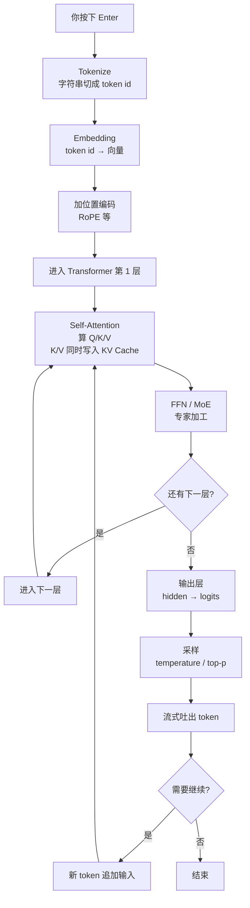
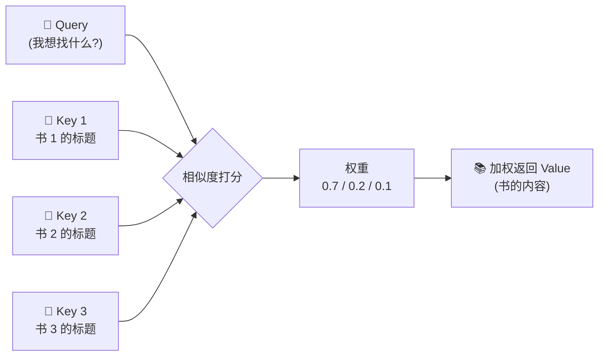
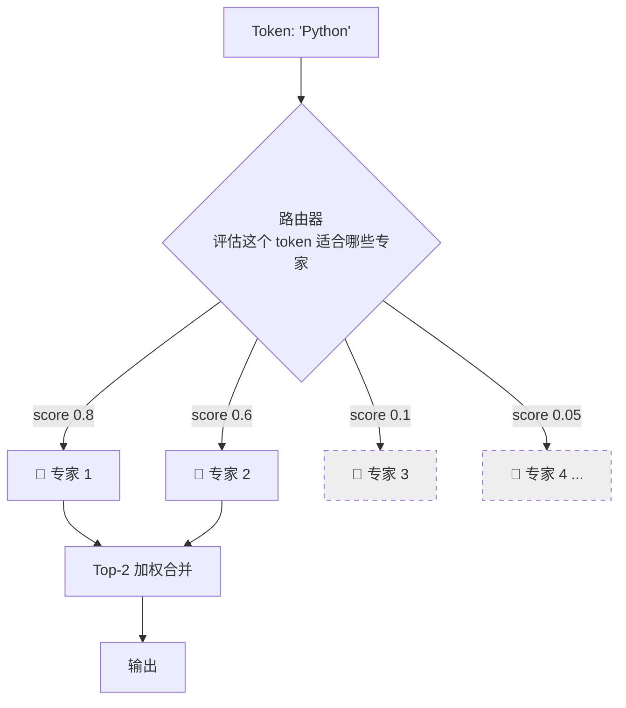
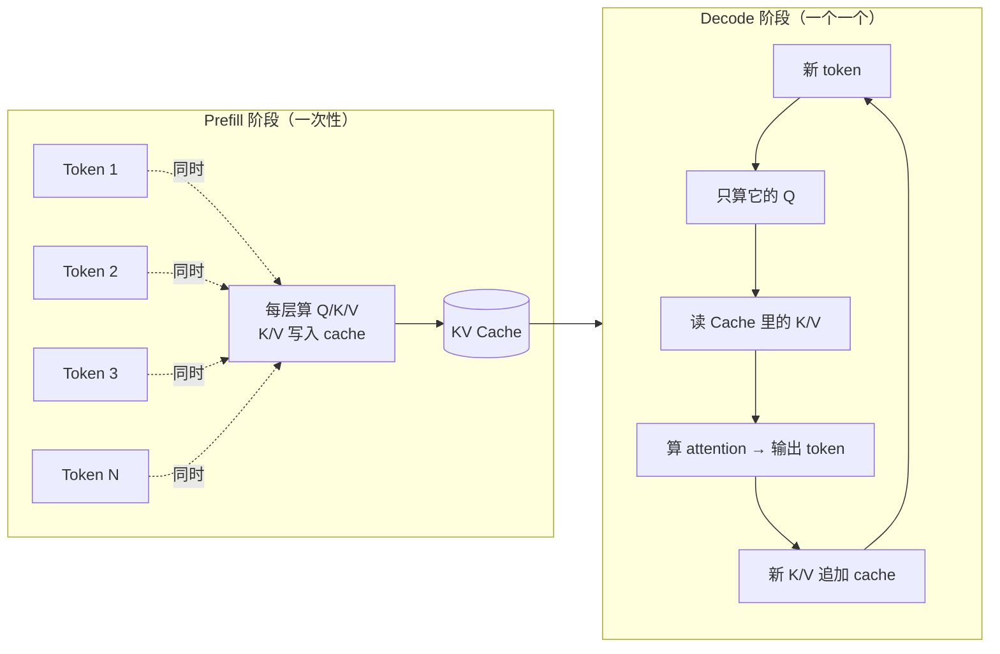
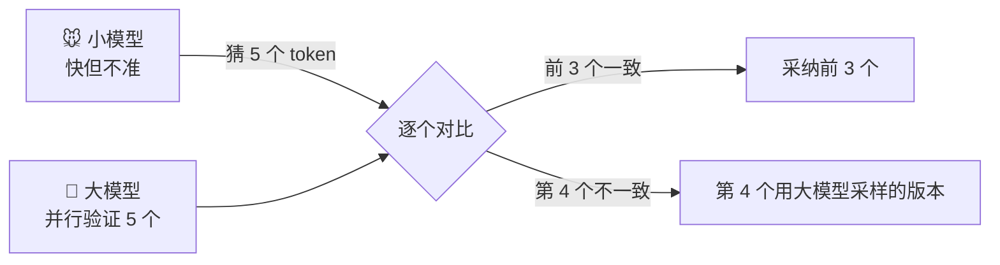
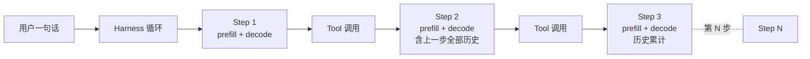
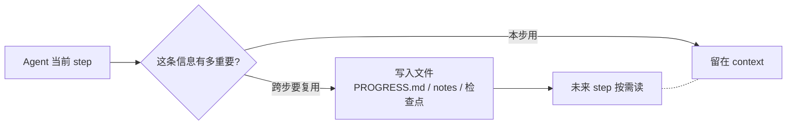
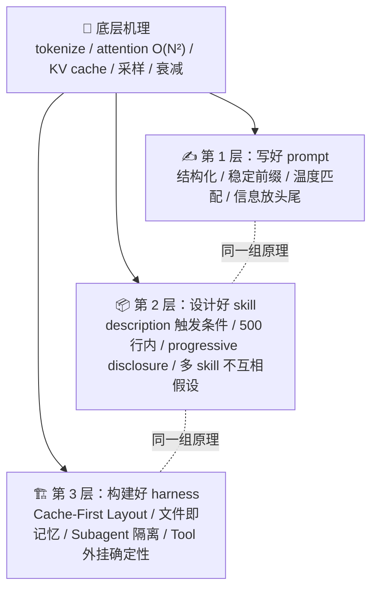

# 按下回车后的 600 毫秒：AI 第一个字是怎么来的

你输入一句话："帮我写一封跟进客户的邮件。"

按下 Enter。

屏幕上闪过一个 spinner，光标变成"…"。然后，第一个字蹦了出来。

"亲"，"爱"，"的"，"客"，"户"，"……"

这中间发生了什么？为什么有时候第一个字蹦得很快，有时候要等好几秒？为什么同一个问题问两次，答案可能不一样？为什么 LLM 数不清 strawberry 里有几个 r？为什么自己搭的 AI agent 跑十步就崩，别人能让它跑十几个小时？

这篇文章把"按下回车到第一个字出现"的前 600 毫秒拆开看一遍。看完后，你会发现写好 prompt、设计好 skill、搭好 agent 这三件看似不同的事，其实背后是同一套底层原理。

---

## 写在最前面：本文的故事场景

为了让"600 毫秒之旅"既好懂又不失真，全文默认这样的场景：你在用一个 **decoder-only 架构**的大模型（GPT、Claude、LLaMA、Qwen 这一脉），它**部署在云端**，你的 prompt 是**典型对话长度**（几百个 token 量级），网络稳定、服务器没有排队、tokenizer 是 BPE 类（OpenAI tiktoken、LLaMA BPE）。

文中给出的毫秒数是**示意性的、用来建立直觉**，不是任何具体模型的实测 benchmark——实际 TTFT（time to first token）受模型大小、prompt 长度、缓存命中、批处理、排队和网络影响，方差非常大。

---

## 一、全流程鸟瞰：AI 不是"读懂你的话再回答"

很多人以为 AI 回答问题的过程像这样：

```text
你的话  →  AI 读懂  →  AI 回答
```

但更接近真实的过程是这样：



一句话总结：模型把你的话**翻译成数字**，在几十层网络里**反复用 attention 串起上下文**，在最后一层**抽签选下一个 token**，再把这个 token 喂回去，循环。

---

## 二、八站时间线：600 毫秒里发生的事

接下来按时间顺序看 8 个关键站点。再次提醒：毫秒数是示意性的。

### 第 1 站 · Tokenize — 把字符切成 token id

**时间（示意）：0~5 毫秒**

模型不直接处理字符串。它只处理一串整数，叫 token id。把字符串切成 token id 的工具叫 tokenizer，主流的实现是 **BPE（Byte Pair Encoding，字节对编码）**——OpenAI 的 tiktoken、LLaMA、Qwen 都用这个家族。也有些模型用 SentencePiece、Unigram 等其他切分方式。

具体怎么切，跟用哪个 tokenizer 强相关。比如用 OpenAI 的 tokenizer 实测：

```text
"I love strawberries"
  cl100k_base  → ["I", " love", " strawberries"]
  o200k_base   → ["I", " love", " strawberries"]

"strawberry"
  cl100k_base  → ["str", "aw", "berry"]
  o200k_base   → ["st", "raw", "berry"]
```

注意到"strawberry"被切成了三段。模型后续看到的是这三段对应的整数 id，**而不是"s-t-r-a-w-b-e-r-r-y"这串字母**。

注意一个关键点：模型看到的是这三个块对应的整数 id，而不是 "s-t-r-a-w-b-e-r-r-y" 这串字母——"r" 散在 `raw` 和 `berry` 两个 token 的内部，并不是独立可数的字符。

类比一下：快递分拣前先把每件包裹贴条码，机器后续所有操作都基于这些条码，而不是包裹本身的样子。

**这一步对写 prompt 的启示**：

模型处理的是 token id 不是字符。所以"strawberry 里有几个 r"这种问题，模型天然不擅长——因为"r"在它眼里被切散在了 `raw` 和 `berry` 这两个 token 内部。**精确数字符、拼字、字符替换这类任务，最好交给确定性的代码或正则，而不是让模型猜**。

同理，纯数字"123456"在某些 tokenizer 下被切成 `123` + `456`，对算术正确性也有真实影响。算 token 预算时，中英文混排也不能简单乘以字数，要用对应模型的 tokenizer 实测。

---

### 第 2 站 · Embedding — token id 变成向量

**时间（示意）：5~15 毫秒**

每个 token id 去查一张巨大的"词表"，得到一个高维向量。现代模型的向量维度通常在 2048 到 8192 之间。

```text
Token id_a ─┐
Token id_b ─┤  → Embedding 矩阵查表 →  4096 维向量 × N
Token id_c ─┘
                                          ↓ 还没有上下文
```

这一步**只是查表**。每个 token 拿到的向量是孤立的、还没有上下文的——就像翻字典，查到了每个词的"词条卡片"，但还没读上下文。

要特别说明的是：早年的静态词向量（word2vec、GloVe）研究发现过 "king - man + woman ≈ queen" 这种神奇的向量算术。但 LLM 的 input embedding 只是 token id 查表，**真正的上下文语义关系主要由后续的 attention 层逐层建立**——别把那个老结论当成"LLM 的语义理解发生在这一层"的证据。

**这一步对写 prompt 的启示**：

同义词替换在很多场景下不影响结果，因为它们在嵌入空间里很接近，但这不是绝对的——领域歧义词（比如"内存"在程序员和心理学家眼里完全不同）要靠后面的 attention 解歧。用对术语会减少模型走偏的概率，但也不能粗暴地说"换个词就一定走偏"。

---

### 第 3 站 · 位置编码 — 让模型知道顺序

**时间（示意）：15~20 毫秒**

Self-attention 本身是位置无关的——它把输入看成一个无序的集合。如果不加位置信息，它分不清"狗咬人"和"人咬狗"。

最早的 Transformer 用 sin/cos 函数做绝对位置编码。**许多现代开源 decoder-only 模型，比如 LLaMA、Qwen 系列，使用 RoPE（Rotary Position Embedding，旋转位置编码）或其变体**；闭源模型如 GPT、Claude 的具体位置编码实现没有公开。

RoPE 的核心思路是：通过旋转 Q 和 K 向量来引入**相对位置**信息。两个 token 之间的相对距离越大，旋转角度的差也越大。

```text
位置 0 →  ➡️
位置 1 →  ↗️
位置 2 →  ⬆️
位置 100 → 🔄 （绕了好几圈）

两个 token 的相对位置 = 它们旋转角度的差
```

类比一下：给每个词戴一只手表——不只告诉你它是什么词，还告诉你它出现在句子的第几秒。

**这一步对写 prompt 的启示**：

RoPE 是现代模型把上下文窗口扩到几十万、上百万 token 的关键技术之一。但你可能听说过一个现象——"重要信息别埋在 prompt 中间"。这个现象有专门的论文（Liu 等人 2023 年的 "Lost in the Middle"）研究过，结果呈一条 **U 型曲线**：开头和结尾的信息利用率最高，中间显著下降。

这个现象的原因比较复杂，可能涉及位置编码、训练数据分布、attention 模式等多重因素，**不能简单地归因到"位置远联系就弱"**。但应对方法是清楚的：重要信息放头放尾。

---

### 第 4 站 · Self-Attention — 每个 token 环顾上下文

**时间（示意）：20~250 毫秒。这是整个流程的主体计算之一。**

这里是 Transformer 的灵魂。

每个 token 会算出三组向量：**Query、Key、Value**，简称 Q、K、V。模型用当前 token 的 Query 去和**所有相关 token 的 Key** 做点积，得到一组"关注度分数"。这些分数经过 softmax 归一化后，作为权重去加权所有的 Value，最后得到一个新的向量——这个向量就是"被上下文调味过的"当前 token 表示。

一个常见的类比是图书馆检索：



Query 是你心里想找什么书；Key 是书架上每本书的标题；Value 是书的内容。模型不是只挑一本书，而是按相关度**加权地"读所有书"**。

现代模型还会做 **Multi-Head Attention**——并行做 8 到 128 组 Q/K/V，每组学不同的关注模式。比如其中一头可能关注主语和谓语的关系，另一头关注代词指向谁。

关于计算复杂度：标准的 dense attention 是 **O(N²)**，N 是 token 数量。不是指数级，是平方级。但平方级也已经很可怕——**prompt 长度翻一倍，prefill 的 attention 时间约变成 4 倍**。

**这一步对写 prompt 的启示**：

一个有用的简化是："模型听懂了你"约等于"它在 attention 里把你想要它联系起来的 token 串起来了"。你可以通过 prompt 结构主动帮它"串"。

具体做法：

- **重要信息放开头和结尾**——这是对 Lost in the Middle 的应对
- **用结构化分隔符**：`<context>` `<task>` `<output>` 这类标签，或 markdown 标题，等于给 attention 提供清晰的边界
- **Few-shot 例子放在 task 前面**，让 task 的 Query 容易 attend 到 example 的 Key
- **prompt 越长 prefill 越贵，O(N²)**，能精简就精简

---

### 第 5 站 · FFN / MoE — Attention 后的专家加工

**时间（示意）：250~350 毫秒。嵌在每层 attention 之后。**

Attention 算完，每个 token 的向量还要过一个**前馈网络（FFN）**做进一步加工。

现代趋势是把单个大 FFN 换成 **MoE（Mixture of Experts，专家混合）**架构。比如 Mixtral 8×7B 模型有 8 个"专家"网络，对每个 token，由一个**路由器**选最相关的 2 个专家来处理。



结果就是：Mixtral 总参数量约 47B，但每个 token 实际只激活约 13B 参数。论文报告它在自己的基准测试上效果匹配或超过 LLaMA-2 70B 和 GPT-3.5。具体的推理加速比取决于硬件、batch size、序列长等因素，不要拍死一个固定数字。

类比一下：医院分诊台。分诊护士不会让所有医生都来看你，而是看一眼你的情况，把你推给最相关的 2 位专科医生。这样医院的"总人力"很多，但每位患者的"边际成本"很低。

---

### 第 6 站 · KV Cache — Prefill 与 Decode 的本质区别

**时间（示意）：与第 4、5 站重叠，是它们的副产物。**

这一站非常重要——它解释了为什么 AI 对话里"第一个字蹦出来慢，后面字蹦出来快"。

整个推理过程分两个阶段：

- **Prefill 阶段**：把你的整个 prompt 一次性并行喂进所有层。每一层算 attention 时，每个 token 的 K（Key）和 V（Value）算出来后**就地写入一块叫 KV Cache 的显存区域**。Prefill 是为后续的 decode 准备弹药。
- **Decode 阶段**：每生成一个新 token，只对**这一个 token**算 Q（Query），然后从 KV Cache 里读出所有历史的 K/V 做 attention。算完后，把新 token 的 K/V 也追加到 cache。然后生成下一个 token，循环。



这两个阶段性质完全不同：

| 维度 | Prefill | Decode |
|---|---|---|
| 处理 token 数 | 整个 prompt 一次性 | 每步 1 个新 token |
| 瓶颈 | 算力（矩阵 × 矩阵） | 显存带宽（矩阵 × 向量） |
| 决定 | TTFT（首字延迟） | 每秒 token 数 |
| 复杂度 | O(N²) 平方 | O(N) 线性（每步） |
| 用户感知 | "等多久才看到第一个字" | "字蹦出来的速度" |

这是为什么第一个字慢、后续字快——后续每个 token 不需要重新算前面所有 K/V，直接从 cache 读就行。

### Prompt Caching：把 prefill 的结果留到下次用

理解了 KV Cache 之后，**Prompt Caching** 的逻辑就很直观了：把已经 prefill 算出来的中间结果在服务端**保留一段时间**，下次请求如果有相同前缀，就跳过那部分 prefill 的计算。各家厂商的具体实现是不是直接保留 KV cache 形式没有公开承诺，但从用户视角看：**前缀命中 → 大幅降低延迟和价格**。

两家主要厂商的做法略有不同：

**Anthropic** 走显式路线：你需要在 API 请求里用 `cache_control` 标记哪段内容要缓存。计费上，cache write 比普通 input 略贵（5 分钟档约 1.25 倍、1 小时档约 2 倍），cache read 约 **0.1 倍计费倍率**——注意这是**计费**层面的折扣，不代表底层计算量严格降到 10%，但延迟降幅通常也很显著。最小可缓存 token 数因模型而异，**以官方当前文档为准**——撰写时 Sonnet 4.5/4.6 是 1024、Opus 4.5/4.6/4.7 和 Haiku 4.5 是 4096。

**OpenAI** 走自动路线：当 prompt 达到 1024 token 以上，系统自动尝试匹配前缀缓存，无需修改 API。官方介绍 latency 最高可降 80%、input token 成本最高可降 90%。

**这一站对写 prompt 的启示**：

- TTFT 主要由 prompt 长度决定，并以 O(N²) 增长
- 把 prompt 写成"**稳定前缀 + 可变后缀**"的结构：system prompt、工具定义、知识库、示例放前面；变化的用户问题放后面
- 多轮对话别改历史——改一个字就 cache miss

---

### 第 7 站 · 输出层 + 采样 — 抽签选下一个 token

**时间（示意）：350~500 毫秒**

最后一层 Transformer 输出的向量，经过一次线性变换，得到一个**和词表一样长的向量**（GPT-4 词表约 10 万 token）。然后 softmax 把这个向量归一化成一个概率分布，最后**采样**——也就是按概率抽签——选出下一个 token。

```text
softmax 后的分布：
  "亲"    35%  ████████████
  "你"    18%  ██████
  "您"    15%  █████
  "尊"     8%  ███
  "Hi"     6%  ██
  ...其余约 9 万 token 共占 18%

→ 抽签结果取决于采样参数
```

三个核心的采样参数：

| 参数 | 干什么 | 调高 | 调低 |
|---|---|---|---|
| **temperature** | 改变分布的"陡峭度" | 更随机、更有创意 | 更确定、更保守 |
| **top-k** | 只从前 k 个最高概率里抽 | k 大 → 更多样 | k 小 → 更专注 |
| **top-p**（nucleus） | 累积概率到 p 就停，从这堆里抽 | 更长尾 | 更窄 |

**这一站对写 prompt 的启示**：

- 同一个 prompt 多次提问结果不同，根源就在这里——**这是正常的**，不是 bug
- temperature = 0 不代表"逻辑确定"，只代表"每次取最高概率"——但底层分布本身可能模糊
- 代码、翻译、结构化提取等任务：用低温（0~0.3）
- 写作、头脑风暴、文案创意：用高温（0.7~1.0）
- 如果发现模型反复输出同一句话，可以试试把 temperature 或 top-p 调高一点

---

### 第 8 站 · 流式输出 + 解码循环

**时间（示意）：500~600 毫秒。第一个 token 出现。**

选到第一个 token 后，立刻通过网络流式发回前端——你看到屏幕上"亲"蹦出来了。

这个 token 同时被追加进输入，开始下一轮 decode。后续每生成一个 token，重复第 4 到第 7 站的简化版：**只对新 token 算 Q，其余 K/V 从 cache 读**。所以后续 token 比第一个 token 快得多。

---

## 三、600 毫秒时间线汇总

用一张表收尾这一节：

| 时间（示意） | 发生了什么 |
|---|---|
| 0~5 ms | Tokenize：字符串切成 token id |
| 5~15 ms | Embedding：每个 id 查表得到向量 |
| 15~20 ms | 加位置编码（如 RoPE） |
| 20~350 ms | Transformer 多层堆叠：每层 self-attention（K/V 写 cache）+ FFN/MoE |
| 350~400 ms | 输出层 → softmax 概率分布 |
| 400~450 ms | 采样选下一个 token |
| 450~600 ms | 流式吐出第一个 token，开始 decode 循环 |

再强调一次：这是讲故事用的量级，不是某个模型的实测 benchmark。实际 TTFT 受太多因素影响——prompt 长度（O(N²)）、模型大小、是否缓存命中、批处理、排队、网络——10 倍以上方差都是常见的。

---

## 四、为什么现在能这么快：底层做了哪些优化

近几年大模型的推理速度提升了好几个数量级。硬件升级只是一部分原因，更多来自工程上的关键突破。

| 优化技术 | 解决的问题 | 效果（含 baseline 说明） |
|---|---|---|
| **FlashAttention** | Attention 反复读写显存，IO 是瓶颈 | 长序列下 2~4 倍加速；显存占用从 O(N²) 降到 O(N)（精确，不是近似） |
| **PagedAttention（vLLM）** | KV cache 内存碎片浪费 60~80% | 浪费降到 4% 以下；论文报告 vs HuggingFace Transformers up to 24 倍吞吐，vs SOTA serving 实际约 2~4 倍 |
| **推测解码** | Decode 串行，一次只出一个 token | 2~3 倍加速，且数学上保证输出分布无损 |
| **MoE 稀疏激活** | 大模型每个 token 都要过全部参数 | 同等推理算力下能扩到更大总参数；Mixtral 47B 总参数 / 13B 激活 |
| **DCA + 稀疏 attention + chunked prefill** | 超长上下文 prefill 极慢、显存爆炸 | Qwen2.5-1M 报告 prefill 阶段约 4 倍加速，激活显存降 96.7% |
| **量化（INT8 / INT4 / FP8）** | 模型权重占显存太多 | 2~4 倍显存压缩，精度损失通常很小 |

挑两个最有故事性的展开讲。

### 推测解码：让小模型先猜，大模型批改



像让实习生先把方案草稿写出来，老板一眼扫过去——对的部分直接通过，不对的部分由老板自己写。比老板从头写快得多，而且**数学上保证最终输出分布和老板独自写完全一致**。

### PagedAttention：用操作系统的思路管理显存

vLLM 提出的 PagedAttention 把 KV cache 当成操作系统的虚拟内存来管——按页分配、动态映射、不再"提前预留座位"。一句话：用 1970 年代解决主存碎片的成熟方案，解决了 2020 年代 GPU 显存碎片的新问题。对长序列、变长 batch 帮助最大。

---

## 五、理解底层后，写 prompt 时应该改变什么

前面讲了那么多底层机理，最直接的收益就是：知道为什么有些 prompt 写法管用，有些不管用。

| 底层机理 | 写 prompt 的对应启示 |
|---|---|
| Tokenize 处理 token id 不是字符 | 不要让 LLM 数字符、拼字、精确替换——交给代码 |
| Attention 对中间衰减（U 型） | 关键信息放头尾；用结构化分隔符 |
| Prefill 是 O(N²) | prompt 翻倍，prefill 约 4 倍——能精简就精简 |
| KV cache 复用前缀 | 稳定前缀（system / 工具 / 知识 / 示例）放前面，变化部分放后面 |
| 采样有随机性 | 温度匹配任务：代码用低温，创作用高温 |
| 上下文窗口大 ≠ 好用 | 用 RAG / 工具调用减少塞 context 的量；关键信息复述一次 |

---

## 六、进阶：从写好 prompt → 设计好 skill → 构建好 harness

前面讲的是**单次 prompt 的 600 毫秒**。但今天我们用 Claude Code、Cursor、Cline 这样的 AI agent 时，本质上是**一连串 prompt 在一个 harness 里循环**。理解了底层之后，能直接指导怎么写 skill、怎么搭 agent 系统。

### 6.1 一次 agent 任务 = N 次 600 毫秒之旅



每一步都是一次完整的 prefill + decode——前面讲的"600 毫秒之旅"会在一次 agent 任务里跑几十次甚至上百次。每一步的输入 = **稳定的前缀（system + 工具定义 + skill metadata）** + **累积的历史（用户消息 + 模型输出 + tool 结果）**。

这意味着，**精简 prompt 长度**、**保持前缀稳定**、**控制工具返回长度**这三件事，不是优化项，是基本盘。

### 6.2 三笔账：Prefill / Decode / Cache

每一步的成本和延迟，分解成三笔账：

| 账目 | 决定什么 | 怎么算（直觉版） | 优化方向 |
|---|---|---|---|
| **Prefill 成本** | TTFT（每步首字延迟） | 与当前 step 输入 token 的 O(N²) 相关 | 控总长 + 缓存命中 |
| **Decode 成本** | 每步生成时长 | 与当前生成 token 数 × 单步固定开销相关 | 控输出长度 + 推测解码 |
| **Cache 折扣** | 价格和时延双降 | 命中部分按 read 折扣计费（Anthropic 约 0.1 倍） | 保持前缀逐字节稳定 |

**多步累积公式**可以粗略表达为：

```text
N 步总成本 ≈ N × cached_prefix_read_cost
            + Σ(uncached_increment_input + decode)
```

意思是：**一个稳定的、长长的 system prefix 会在 N 步里被 N 次命中折扣价计费**——它每步都参与输入计算，但走的是缓存读取通道；**真正按全价 prefill 的，是每步新增的那部分增量**。

含义：
- 长 system + 稳定工具定义 → 每步都命中折扣 → 边际成本主要在"每步增量"
- 动态变化的 system（带时间戳、随机 ID、step 计数）→ 每步都 miss → N 次全价

### 6.3 Skill 的设计：理解 progressive disclosure

Anthropic 把 Agent Skills 设计成一个"三层渐进披露"的结构。**这是 Anthropic API Skills 官方文档里的明确说法**：

| 层级 | 加载时机 | Token 开销 | 内容 |
|---|---|---|---|
| **Level 1：Metadata** | 启动时常驻 | 约 100 token / skill | YAML frontmatter 里的 `name` 和 `description` |
| **Level 2：Instructions** | 被触发时加载 | < 5k token | SKILL.md 主体的指令和指导 |
| **Level 3：Resources** | 用到时加载 | 实际无上限 | 引用的脚本、参考材料等——脚本只回返结果，不进 context |

理解这个三层机制后，skill 设计的关键就清楚了：

**Description 是判断"要不要加载这个 skill"的依据**。Claude 在启动时只看到所有 skill 的 name 和 description；用户消息进来后，它根据 description 判断哪些 skill 可能匹配，然后才用 bash 读 SKILL.md。

> 一个有用的类比（这是类比，不是官方对实现的描述）：你可以把 description 想象成挂在书架封面的"书脊标题"，模型在做决策时 attend 到匹配的标题，再去翻具体那本书。Anthropic 并没有承诺这是某种 K/V 路由机制——只是行为上类似一个轻量级、由模型判断的路由。

设计建议：

- **description 要"具体 + 含触发场景"**：80~150 字，写清楚"做什么 + 何时该用 + 何时不该用"。模糊不命中，太窄永远不命中
- **SKILL.md 主体控制在 500 行内**（Anthropic 官方建议）；过长会一次性占太多 context
- **正文里可以写 workflow、best practices、guidance**——官方明确支持。但要短、可执行、少跨 skill 隐式依赖
- **多个 skill 之间互相不假设存在**——模型一次只会加载子集，不会推理出 skill 间的隐式依赖

另外要注意：**Claude Code 的 frontmatter 字段（如 `disable-model-invocation`、`user-invocable`）是 Claude Code 专属的**，Anthropic API Skills 的 frontmatter 表面以官方 Skills API 文档为准。两套系统的字段不完全一致。

#### Description 的 token 经济学

假设你的 vault 里有 50 个 skill，每个 description 100 token，那就是 5K token 常驻 system。这 5K token 每一步都参与输入计算（命中 cache 后按读取折扣计费）。**结论**：description 在保证清晰的前提下尽量精炼；vault 里**全局唯一调用场景的 skill** 比"很多触发条件重叠的 skill" 更经济。

### 6.4 Harness 的设计：Context Engineering 三原则

从底层机理推导，harness 系统的设计目标是：**在 O(N²) 的 prefill 成本和 attention 衰减的双重约束下，让 agent 跑得久、跑得对、跑得便宜**。

#### 原则 1：稳定前缀，可变后缀（Cache-First Layout）

底层原因：缓存命中要求前缀逐字节匹配。

把每一步的 prompt 在心里分成三层：

```text
┌─────────────────────────────────┐
│ 永远稳定（命中 cache）：           │
│   - system prompt                │
│   - 工具定义（顺序固定）          │
│   - 项目级 CLAUDE.md / 规则       │
│   - 不变的知识库 / 示例           │
├─────────────────────────────────┤
│ 偶尔变化（partial 命中）：         │
│   - 已确认的历史消息              │
│   - 已完成的步骤结果              │
├─────────────────────────────────┤
│ 每步变化（必然 miss）：            │
│   - 当前用户消息                  │
│   - 当前 tool result              │
└─────────────────────────────────┘
```

常见的反模式：
- system 里塞 `当前时间：2026-05-27 14:30:21` → 每秒都 miss
- 每步在 system 末尾加 `这是第 5 步 / 共 10 步` → 每步 miss
- 工具列表动态排序 → 顺序变 = 后续全部 miss

#### 原则 2：信息要么进 system（永久），要么进近期 turn（在头尾的注意力范围）

底层原因：Lost in the Middle 现象——埋在中间的内容利用率明显低。

做法：

- **不变的关键约束**（"必须用 TypeScript / 必须有测试 / 不能改这个文件"）写进 system 或 CLAUDE.md → 永远在开头
- **本步关键信息**（用户最新意图、最近 tool result）→ 自然在结尾
- **历史中间的细节**（之前的 reasoning、长 tool 输出）→ 摘要或丢弃，不要原文堆积

反模式：把"重要前置约束"放在第 5 条 user message 里——跑到第 20 步时，这条约束已经埋进了中间，模型的 attention 利用率会显著下降。

#### 原则 3：状态写到 attention 之外（用文件对抗 attention 衰减）

底层原因：context 是 O(N²) 成本，而且对中间内容有衰减；而**文件不会自动进入每一步 prefill——只有按需读取时才占 context**。



典型的外挂记忆模式：
- `PROGRESS.md` / `STATUS.md`：长任务的进度状态
- `decisions.md`：已做的决定 + 理由
- 检查点文件：完成的子任务结果
- `/save`、`/go` 这类显式命令：把当前对话压缩成文件，下次 `/go` 时只读最关键部分

反模式：让 agent "凭记忆"在长 context 里找之前算过的结果——不如直接写文件、读文件。

### 6.5 Subagent：给子任务一个干净的 attention 场

为什么 subagent 是个好模式？因为父 agent 的累积 context 对子任务是噪音；父 agent 的 O(N²) 不该让子任务也承担。

```text
父 agent 单步成本：
  prefill (system + tools + 累积历史) + decode

Subagent 单步成本：
  父成本不变，但只接收子的"结论"
  子成本：prefill (子自己的 system + tools，不含父的历史) + decode

总 token：子在每次 spawn 都重新付一次自己的 prefill 起点
```

**什么时候值得 spawn subagent**：

| 信号 | 为什么用 subagent |
|---|---|
| 子任务输入小、输出小、过程长 | 父 context 不被过程污染 |
| 子任务高度独立，不需要父的最新动态 | 子的 system 可以完全静态 → cache 友好 |
| 多个子任务可并行 | 比串行节省 wall-clock 时间 |
| 探索性任务，结果可能要丢弃 | 失败的探索不污染父 context |

**什么时候不要用 subagent**：
- 子任务需要频繁回查父 context 的最新决策（来回交换成本高）
- 子任务本身就一两步能搞定（额外的 prefill 起点不划算）

### 6.6 Tool Use：把模型不擅长的外包给确定性系统

底层视角：
- **Tokenize 看不到字符** → 拼字、字符替换交给代码
- **采样有随机性** → 精确算术、布尔判断交给代码
- **Attention 有衰减** → 长文档查找交给检索（grep / RAG）
- **Context 是 O(N²)** → 大数据存查交给数据库 / 文件系统

好工具 vs 坏工具（agent 视角）：

| 维度 | 好工具 | 坏工具 |
|---|---|---|
| 返回长度 | 摘要 + 可选 detail | 全量原始输出 |
| 接口 | 强类型 schema | 自由格式字符串 |
| 错误信息 | 短 + 明确 + 可恢复 | stack trace 几千行 |
| 副作用 | 显式（"已写入 X 文件"） | 隐式（"成功"） |
| 幂等性 | 重复调用安全 | 重复调用会破坏状态 |

常见的反模式：
- 工具默认返回完整文件内容——应该返回路径 + 行号 + 摘要，按需展开
- 工具返回里塞大量 metadata（时间戳、id 等）——浪费每步 prefill
- 错误时把整个 traceback 塞回——应该提取关键 message + 建议

### 6.7 三层是同一套底层机理的不同应用



一句话总结：写好 prompt 是单步优化，设计好 skill 是把单步能力**模块化、可触发化**，构建好 harness 是把多步组合的**成本、注意力、状态**管理好。三件事，同一套底层原理。

---

## 七、结尾：一次对话，是一场精密协作的缩影

对人来说：

```text
你输入了一句话，AI 回答了你。
```

对机器来说：

```text
一次跨越 tokenizer / 几十层 transformer /
数十亿次矩阵乘法 / 动态显存调度 / 概率采样 /
流式传输 的完整旅程。
```

你看到的是屏幕上一行字。机器看到的是一次完整的、复杂的、有不确定性的协同。

写好 prompt，不是学一套话术。
做好 skill，不是堆模板。
搭好 harness，不是套架构。

这三件事的本质，是**理解机器在干什么**——它在 tokenize 什么、在 attention 谁、在 cache 什么、在采样什么、在循环到哪一步。

知道了这些，你就知道：为什么这样写它能听懂、那样写它就跑偏；为什么这个 skill 总不触发、那个 skill 一句话就被调用；为什么这个 agent 越跑越笨、那个 agent 跑十几个小时还在状态。

---

## 参考资料

### Transformer 与 LLM 底层原理

- Vaswani et al., *Attention Is All You Need*（2017）：https://arxiv.org/abs/1706.03762
- Jay Alammar, *The Illustrated Transformer*：https://jalammar.github.io/illustrated-transformer/
- Andrej Karpathy, *Neural Networks: Zero to Hero*：https://karpathy.ai/zero-to-hero.html
- Su et al., *RoFormer: Enhanced Transformer with Rotary Position Embedding*：https://arxiv.org/abs/2104.09864

### 上下文与注意力研究

- Liu et al., *Lost in the Middle: How Language Models Use Long Contexts*（2023）：https://arxiv.org/abs/2307.03172
- Ding et al., *LongRoPE*：https://arxiv.org/abs/2402.13753

### 现代推理优化

- Dao et al., *FlashAttention*：https://arxiv.org/abs/2205.14135
- Shah et al., *FlashAttention-3*：https://tridao.me/publications/flash3/flash3.pdf
- Kwon et al., *Efficient Memory Management for LLM Serving with PagedAttention*：https://arxiv.org/abs/2309.06180
- vLLM 官方介绍：https://blog.vllm.ai/2023/06/20/vllm.html
- Xia et al., *Speculative Decoding 综述*：https://arxiv.org/abs/2401.07851
- Jiang et al., *Mixtral of Experts*：https://arxiv.org/abs/2401.04088
- Qwen Team, *Qwen2.5-1M Technical Report*：https://arxiv.org/abs/2501.15383

### 采样与 Prompt Caching

- Sebastian Raschka, *Temperature, Top-K, Top-P Sampling*：https://sebastianraschka.com/faq/docs/temperature-topk-topp-sampling.html
- Anthropic Prompt Caching 文档：https://platform.claude.com/docs/en/build-with-claude/prompt-caching
- OpenAI Prompt Caching 介绍（2024）：https://openai.com/index/api-prompt-caching/
- OpenAI Prompt Caching 文档：https://platform.openai.com/docs/guides/prompt-caching

### Skills 与 Agent 设计

- Anthropic, *Agent Skills 官方文档*：https://platform.claude.com/docs/en/agents-and-tools/agent-skills/overview
- Anthropic, *The Complete Guide to Building Skills for Claude*（PDF）：https://resources.anthropic.com/hubfs/The-Complete-Guide-to-Building-Skill-for-Claude.pdf
- Anthropic Engineering, *Equipping agents for the real world with Agent Skills*：https://www.anthropic.com/engineering/equipping-agents-for-the-real-world-with-agent-skills
- Claude Code Skills 文档：https://code.claude.com/docs/en/skills
- OpenAI tiktoken（实测 token 切分）：https://github.com/openai/tiktoken

### 相关阅读

- [prompt → skills → harness → OPC：我的 AI 实践与思考](/writing/prompt-skills-harness-opc/) — 这条路径在我自己的实践中是怎么走出来的，跟本文的"底层原理 → 三层推导"互为补充。
