**普通人学习 AI 的技术路线，如何进一步长成自己的 AI-native Founder OS。**

---

## 0. 总体地图：从技术路线到创业操作系统

### 0.1 主路径

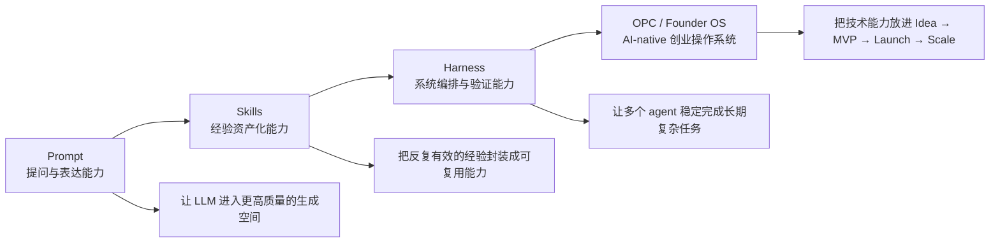

### 0.2 这场分享的核心判断

`prompt → skills → harness` 是我目前认为普通人学习 AI 最合理的一条技术路线。

它们构成三层能力升级：

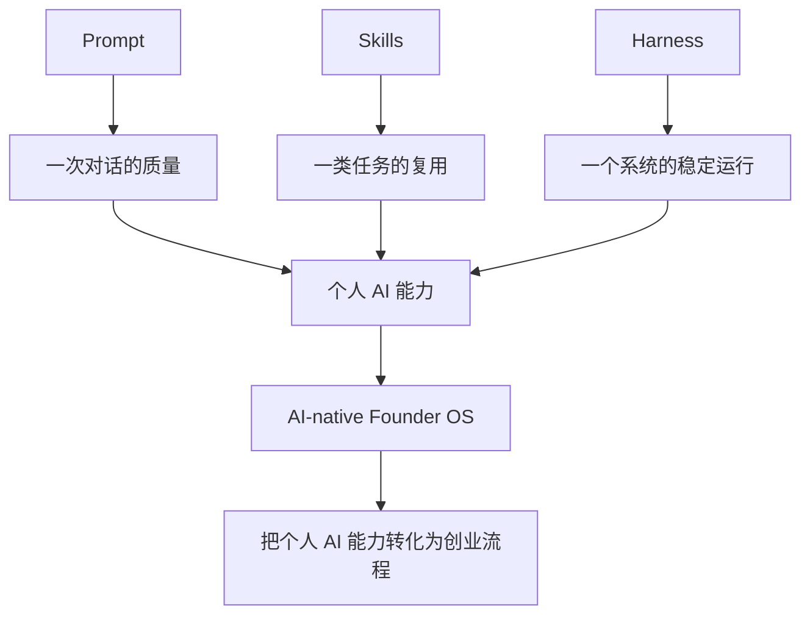

最终落点：

> prompt 训练表达,skills 训练流程,harness 训练系统。
> Founder OS 训练判断:什么值得做,什么时候做,做到什么程度。

### 0.3 四个模块的承接关系

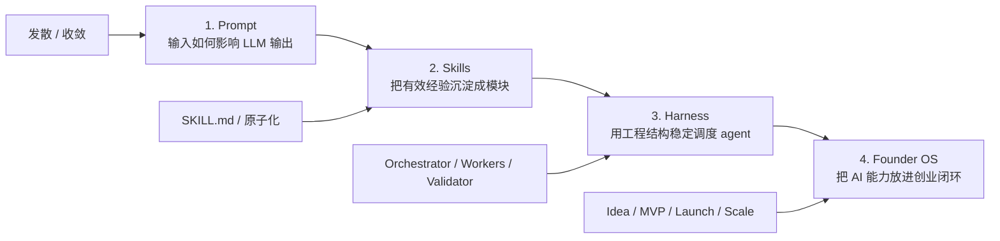

---

## 1. 开场:我的实践路径

这条路径是怎么长出来的:

- 最开始从 prompt 入手
- 后来发现反复有效的 prompt 应该沉淀成 skills
- 再后来发现复杂任务需要 harness 来保证稳定性
- 最近读 Anthropic《The Founder's Playbook》,把这条技术路线放进创业流程里重新理解

### 开场图

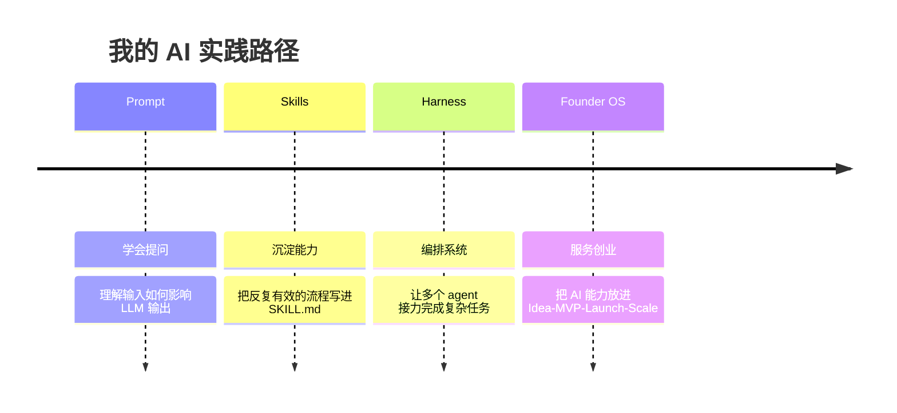

---

## 2. 第一节:Prompt 依然是重要能力

### 2.1 本节主线

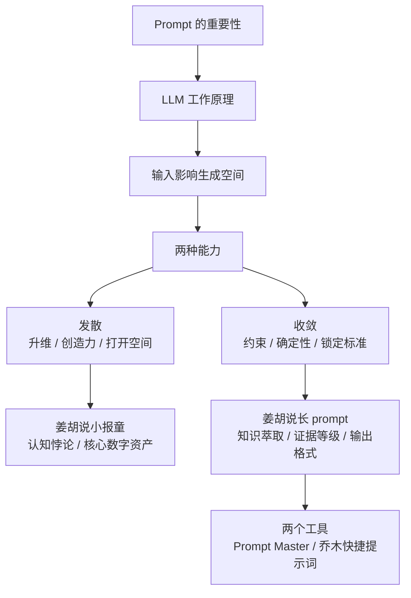

### 2.2 本节主要讲什么

Prompt 依然重要。

模型能力越强,prompt 越像一种"方向盘":

- 发散时,prompt 决定 AI 往哪里想
- 收敛时,prompt 决定 AI 按什么标准交付
- 协作时,prompt 暴露人的问题定义能力、上下文组织能力和判断标准

这一节讲两部分:

1. LLM 的工作原理
2. 写好 prompt 的两种思路:发散 vs 收敛

### 2.3 LLM 工作原理:输入在塑造生成空间

LLM 根据上下文生成后续内容。你的输入会影响它接下来生成什么、以什么层级生成、采用什么语气和结构生成。

可以从四个信号讲:

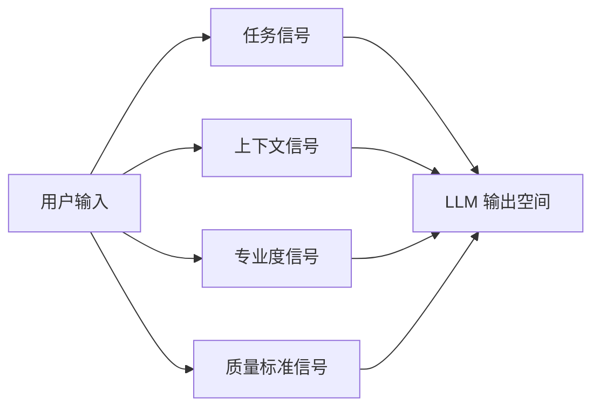

要点:

- 模糊输入通常得到平均答案
- 高质量输入会提高输出上限
- 专业词、任务边界、上下文和验收标准都会改变模型输出
- prompt 能力本质上是问题定义能力

参考资料:

- 论文:[Why Johnny Can't Prompt: How Non-AI Experts Try and Fail to Design LLM Prompts](https://dl.acm.org/doi/10.1145/3544548.3581388)
- 论文:[Principled Instructions Are All You Need for Questioning LLaMA-1/2, GPT-3.5/4](https://arxiv.org/abs/2312.16171)

### 2.4 写好 prompt 的两种思路:发散 vs 收敛

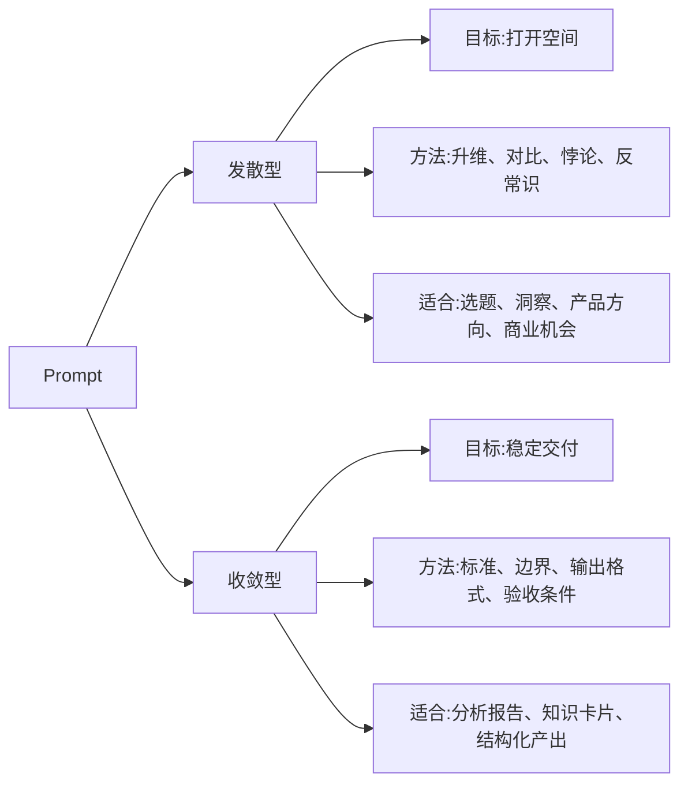

本节核心判断:

> 发散型 prompt 负责打开空间,收敛型 prompt 负责锁定质量。

### 2.5 发散型 prompt:升维

发散型 prompt 的重点是定义思考方向。

它不急着规定格式,也不急着控制步骤。它通过关键词、对比关系、反常识问题,把 AI 推进更高价值的思考空间。

#### 案例 1:认知悖论

```text
在[个人成长/赚钱致富/自媒体]领域,普遍存在的认知悖论是什么——即那些人们深信不疑,却在根本上阻碍他们成功的想法。
```

讲解重点:

- "认知悖论"让 AI 去找矛盾结构
- "深信不疑"让 AI 找共识里的盲点
- "根本阻碍成功"让 AI 找高影响因子
- 这类 prompt 的价值在于升维

#### 案例 2:核心数字资产

```text
请你找到对我来说已经轻车熟路,但是对其他人难如登天的"核心数字资产",稍加更改对他们来说就特别有用的"产品"。
```

讲解重点:

- "轻车熟路 vs 难如登天"构成价值差
- 这比直接问"我能做什么产品"更好
- 它把产品思考从"市场上有什么"转到"我的不对称优势是什么"

### 2.6 收敛型 prompt:约束

收敛型 prompt 的重点是定义质量标准。

它不只是"写得长"。它真正有价值的部分是:

- 输入边界
- 角色定位
- 北极星目标
- 证据等级
- 排除规则
- 输出结构
- 质量门槛

#### 案例:长内容洞见提取 prompt

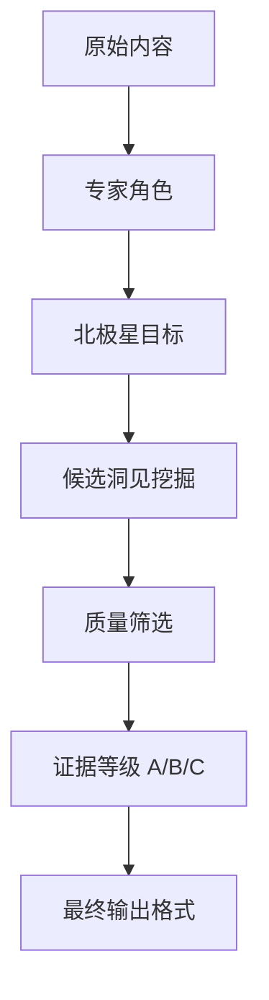

讲解重点:

- 它的细节集中在质量标准、筛选门槛和交付格式
- 它把"好洞见"从感觉变成可检查条件
- 它适合结构化产出,不适合所有探索任务

### 2.7 Prompt 部分的两个小工具

#### 工具 1:Prompt Master

链接:[nidhinjs/prompt-master](https://github.com/nidhinjs/prompt-master)

- 适合把模糊需求整理成可复制 prompt
- 补齐任务、目标工具、输出格式、约束、输入材料、上下文、受众、成功标准、样例
- 可以现场演示:把"我要做一个 AI 分享"改写成更清晰的 prompt

#### 工具 2:乔木快捷提示词 Chrome 插件

链接:[乔木快捷提示词 Chrome 插件](https://chromewebstore.google.com/detail/%E4%B9%94%E6%9C%A8%E5%BF%AB%E6%8D%B7%E6%8F%90%E7%A4%BA%E8%AF%8D/ndfmbdiaclladmoeifbhlkacllmfhjej)

- 管理常用 prompt
- 浏览器里搜索、复制、分类
- 让 prompt 从聊天记录变成可复用资产

---

## 3. 第二节:Skills,把经验沉淀成可复用能力

### 3.1 本节主线

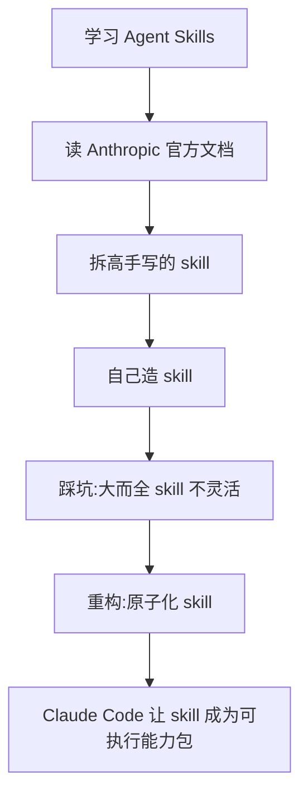

### 3.2 本节主要讲什么

Skills 是第二层能力。

Prompt 解决一次对话。Skill 解决一类任务的复用。

本节讲三件事:

1. Anthropic Agent Skills 的底层机制
2. 自己学习 skill 的路径
3. 为什么 skill 要原子化

### 3.3 Agent Skills 的机制

参考资料:

- [Anthropic Agent Skills overview](https://platform.claude.com/docs/en/agents-and-tools/agent-skills/overview)
- [Equipping agents for the real world with Agent Skills](https://www.anthropic.com/engineering/equipping-agents-for-the-real-world-with-agent-skills)

要点:

- Anthropic 的贡献在于:把 Agent Skills 做成了 Claude 体系里的正式机制
- 一个 skill 是一个目录
- 核心文件是 `SKILL.md`
- 可以包含 scripts、references、assets
- Claude 通过 progressive disclosure 按需加载

### 3.4 Progressive disclosure

概念解释:progressive disclosure(渐进式披露)——分步逐步展示信息,先显核心内容,按需展开详情。

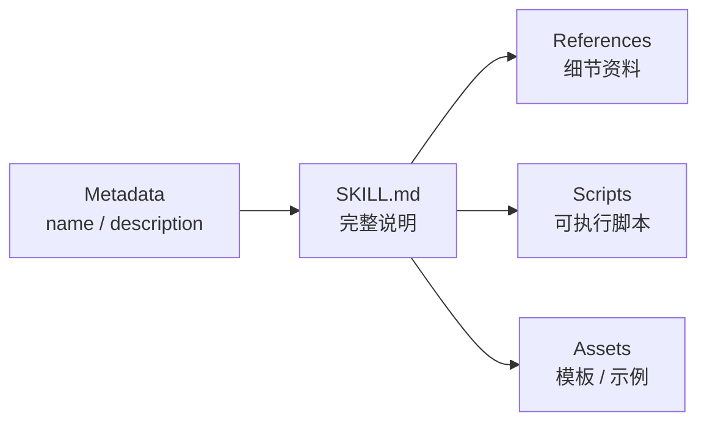

- AI 先知道有哪些能力
- 任务相关时才读完整说明
- 真正需要细节时再读 references / scripts
- 这解决的是上下文效率问题

### 3.5 我的 skill 学习路径

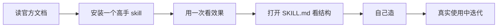

每一步:

1. 读官方文档:理解结构和加载机制
2. 学最佳实践:看别人的 description、触发条件、工作流、禁止事项、references、scripts
3. 自己造:从真实需求出发,用一次改一次

### 3.6 原子化:skill 像乐高

#### 旧结构:大而全内容 skill

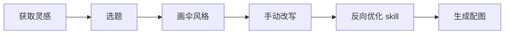

问题:

- 想单独用生图能力时,要从大 skill 里拆
- agent 读了很多无关上下文
- 完整工作流会带偏单点任务
- 功能越多,边界越模糊

#### 新结构:多个原子 skill

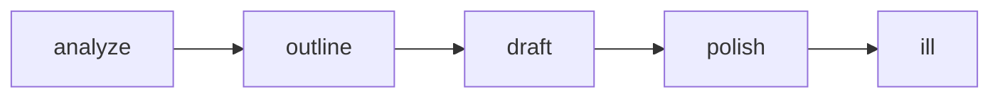

核心判断:

> skill 的价值来自清晰边界。边界越清楚,越容易单独使用,也越容易组合。

### 3.7 Claude Code 和 Agent Skills 为什么一起流行

参考资料:

- [Claude Code 官方页](https://claude.com/product/claude-code)

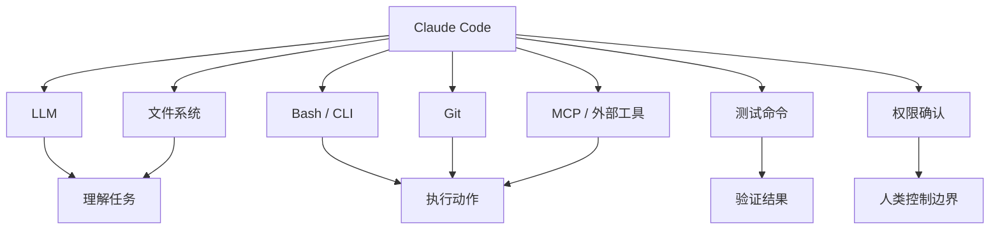

- Claude Code 让 LLM 进入真实工作环境
- Bash 是关键的"手",文件系统、Git、测试、权限确认和执行循环共同构成闭环
- 文件系统让 skill 有地方放
- scripts 让 skill 不只是文字说明
- 测试和 Git 让 agent 能闭环验证

### 3.8 小故事:我学 AI 的一个习惯,先把缩写还原成英文

很多 AI 工具、工程工具、命令行概念都是缩写。学习时先把缩写还原成完整英文,能快速理解它到底在做什么。

例子 1:

```text
cd = change directory
```

这个命令每天都会看到。还原成英文以后就很直观:切换目录。

例子 2:

```text
bash = Bourne Again Shell
```

Bash 的名字来自一个程序员冷笑话:

- Stephen Bourne 创建了早期 Unix 的 Bourne Shell,也就是 `sh`
- Brian Fox 后来开发了 Bash,本质上是在重写和增强 Bourne Shell
- 所以 Bash 叫 **Bourne Again Shell**
- 这里同时致敬 Bourne Shell,也借用了英语里的 **Born Again**,也就是"重生"这个双关

可以用一张小图解释:

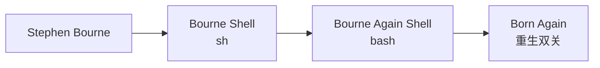

这个小故事服务一个判断:

> 学 AI 不能只学工具按钮。常见词背后的英文原意、历史来源和使用场景,往往会帮你更快理解工具的能力边界。

---

## 4. 第三节:Harness Engineering,把能力组织成稳定系统

### 4.1 本节主线

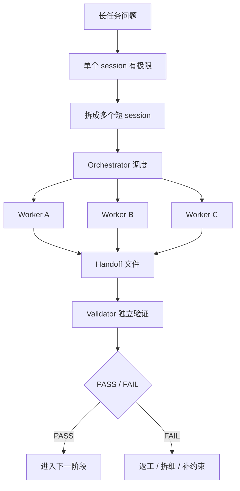

### 4.2 本节主要讲什么

Harness 是第三层能力。

Prompt 解决单次对话质量。Skill 解决能力复用。Harness 解决长任务可靠性。

本节讲:

1. 单个 agent 为什么跑不长
2. harness 解决哪些问题
3. Orchestrator / Worker / Validator 的协作结构
4. FloatTrans 和 cmux 是实践案例

### 4.3 Harness 的定义

> Harness 是一套工程结构,用来让 AI agent 在长任务里持续、稳定、可验证地工作。

它包括:

- agent 怎么启动
- 拿到什么上下文
- 能用什么工具
- 当前任务边界是什么
- 产出写在哪里
- 谁来验证
- 失败后怎么恢复
- 下一个 agent 怎么接上

参考资料:

- [Anthropic: Effective harnesses for long-running agents](https://www.anthropic.com/engineering/effective-harnesses-for-long-running-agents)
- [Anthropic: Scaling Managed Agents](https://www.anthropic.com/engineering/managed-agents)
- [OpenAI: Harness engineering](https://openai.com/index/harness-engineering/)

### 4.4 Harness 解决的问题

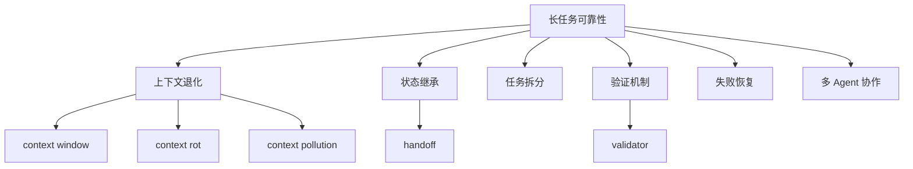

要点:

- 长上下文会降低质量,但这只是 harness 的一部分
- 状态继承依赖文件、commit、handoff 这类外部载体
- 验证必须独立出来
- 并行 worker 需要明确边界和依赖关系

### 4.5 三角色架构:Orchestrator / Workers / Validator

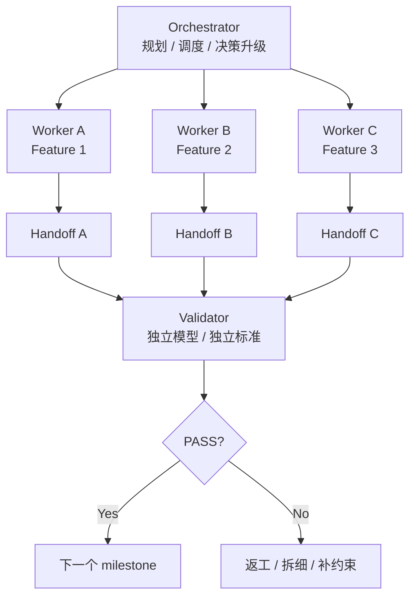

#### Orchestrator 编排者/总指挥

- 做规划和调度
- 管依赖关系
- 判断什么时候并行
- 判断什么时候要问人
- 不直接写实现

#### Workers 执行者

- 每个 worker 做一个边界清楚的任务
- worker 最好 fresh context
- 三个 worker 并行表达 agent teams 的价值
- 并行前提:任务没有强文件依赖

#### Validator 验证器/质检员

- 独立验证,不做橡皮图章
- 最好用不同模型或不同 provider
- 至少要独立 session + 独立验收标准
- 输出 PASS / FAIL 和原因

### 4.6 FloatTrans 实践

- FloatTrans 是第一次完整跑 harness 思路的项目
- Phase 1 拆成 11 个 feature / 4 个 milestone
- Worker 执行单个任务
- Handoff 文件传状态
- Validator 独立审查
- 最重要的收获:状态传递比 prompt 本身更重要

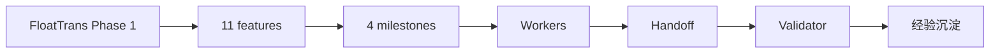

### 4.7 cmux 多 Agent 实践

参考资料:

- [cmux 官方仓库](https://github.com/manaflow-ai/cmux)

cmux 给了多 agent 协作的基础设施:

- 查看 agent 拓扑
- 读取某个 agent 屏幕内容
- 给某个 agent 发送任务
- 让 Orchestrator 直接调度 worker / validator

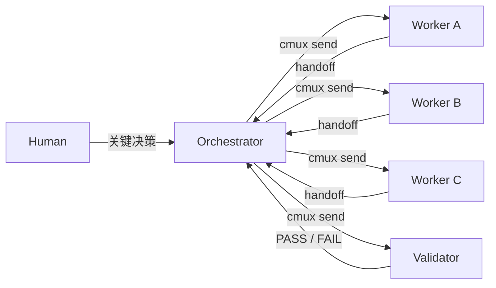

核心判断:

> 人的角色从传话筒变成决策官。

### 4.8 OpenClaw / Hermes 的位置

参考资料:

- [OpenClaw GitHub](https://github.com/openclaw/openclaw)
- [Hermes Agent GitHub](https://github.com/NousResearch/hermes-agent)

- 它们是值得研究的 agent / harness 系统
- 我还没有深入使用,不展开评价
- 可以作为后续学习方向
- 本次只讲自己真实实践过的 FloatTrans / cmux / harness 经验

### 4.9 本节收束

> Harness 把 AI 协作从"一次生成"推进到"可拆分、可交接、可验证、可恢复"。

---

## 5. 第四节:Founder Playbook,把技术路线放进创业系统

### 5.1 本节主线

```mermaid
flowchart LR
    A["技术路线<br/>prompt → skills → harness"] --> B["创业操作系统"]
    B --> C["Idea"]
    C --> D["MVP"]
    D --> E["Launch"]
    E --> F["Scale"]

    C --> C1["验证问题"]
    D --> D1["构建最小产品"]
    E --> E1["发布与反馈"]
    F --> F1["运营自动化"]
```

### 5.2 本节主要讲什么

Anthropic《The Founder's Playbook》把思路从 Learn by building 收敛到:

```text
Idea → MVP → Launch → Scale
```

核心转变:

> AI 不只参与 coding。AI 应该参与创业全流程。

参考资料:

- [Anthropic: The Founder's Playbook](https://claude.com/blog/the-founders-playbook)
- [徐文浩中英对照版:创始人手册](https://xuwenhao.com/library/founders-playbook-bilingual.html)

### 5.3 从 individual contributor 到 orchestrator

参考资料:[徐文浩中英对照版 Chapter 2:角色之变](https://xuwenhao.com/library/founders-playbook-bilingual.html#c2)

- 创始人的工作重心上移
- AI 承担越来越多执行
- 创始人更像 orchestrator
- 关键能力变成判断、取舍、设计系统

### 5.4 Idea:验证问题

参考资料:[徐文浩中英对照版 Chapter 3:构思](https://xuwenhao.com/library/founders-playbook-bilingual.html#c3)

Idea 阶段要让 AI 帮你做:

- 市场研究
- 竞品分析
- 用户访谈问题设计
- 反证分析
- 需求假设拆解

关键问题:

- 这个问题真实吗
- 谁有这个问题
- 现在怎么解决
- 有没有高频或高痛感
- 有没有付费信号

### 5.5 MVP:边界由人定义,构建交给 AI 加速

参考资料:[徐文浩中英对照版 Chapter 4:MVP](https://xuwenhao.com/library/founders-playbook-bilingual.html#c4)

MVP 阶段可以用 Claude Code / Codex / Cursor / OpenClaw / Hermes 这类工具。

人要定义:

- 验证哪一个假设
- 只做哪一个核心动作
- 不做哪些功能
- 验收标准是什么
- 什么情况算失败

核心判断:

> AI coding 能力越强,人越要有边界感。

### 5.6 Launch:发布和反馈

参考资料:[徐文浩中英对照版 Chapter 5:发布](https://xuwenhao.com/library/founders-playbook-bilingual.html#c5)

AI 可以帮你快速做:

- landing page
- 发布文案
- FAQ
- 用户反馈整理
- bug triage
- 指标面板

关键观察:

- 用户是否回来
- 是否愿意付费
- 是否主动反馈
- 是否把产品嵌进工作流
- 失去它会不会难受

### 5.7 Scale:运营自动化

参考资料:[徐文浩中英对照版 Chapter 6:规模化](https://xuwenhao.com/library/founders-playbook-bilingual.html#c6)

Scale 阶段,AI 的价值在重复运营流程:

- 周报自动汇总
- 用户反馈自动归类
- CRM 自动更新
- 文档自动同步
- 内容日历自动生成
- 数据异常自动提醒

核心判断:

> 一人公司最稀缺的是注意力。AI-native Founder OS 的价值,是把注意力留给判断。

### 5.8 网页 ChatGPT + Codex 的实际分工

参考资料:[OpenAI Help: Using Codex with your ChatGPT plan](https://help.openai.com/en/articles/11369540-using-codex-with-your-chatgpt-plan)

```mermaid
flowchart LR
    A["网页 ChatGPT"] --> A1["讨论"]
    A --> A2["研究"]
    A --> A3["需求分析"]
    A --> A4["PRD"]
    A --> A5["视觉探索"]

    B["Codex"] --> B1["读代码"]
    B --> B2["改文件"]
    B --> B3["跑测试"]
    B --> B4["修 bug"]
    B --> B5["重构"]
```

核心判断:

> 网页 ChatGPT 负责想清楚,Codex 负责做出来。

### 5.9 本节收束

> AI-native Founder OS 是把 prompt、skills、harness 这三层技术能力,放进 Idea、MVP、Launch、Scale 的创业闭环。

---

## 6. 最终收束

### 6.1 收束图

```mermaid
flowchart LR
    A["Prompt"] --> A1["表达与问题定义"]
    B["Skills"] --> B1["流程与经验资产"]
    C["Harness"] --> C1["系统与验证"]
    D["Founder OS"] --> D1["判断与创业闭环"]

    A --> B
    B --> C
    C --> D
```

### 6.2 最终判断

AI 能力会继续变强。

执行会越来越便宜。

普通人要同时练四件事:

- 能不能问出高质量问题
- 能不能把经验沉淀成模块
- 能不能把模块组织成系统
- 能不能把系统服务于真实目标

最终句:

> AI 时代最大的风险,是 build 太容易以后,人更容易逃避"这件事到底值不值得做"。

---

## 7. 相关资料链接

### Prompt

- [Prompt Master](https://github.com/nidhinjs/prompt-master)
- [乔木快捷提示词 Chrome 插件](https://chromewebstore.google.com/detail/%E4%B9%94%E6%9C%A8%E5%BF%AB%E6%8D%B7%E6%8F%90%E7%A4%BA%E8%AF%8D/ndfmbdiaclladmoeifbhlkacllmfhjej)

### Skills

- [Anthropic Agent Skills overview](https://platform.claude.com/docs/en/agents-and-tools/agent-skills/overview)
- [Equipping agents for the real world with Agent Skills](https://www.anthropic.com/engineering/equipping-agents-for-the-real-world-with-agent-skills)
- [Claude Code 官方页](https://claude.com/product/claude-code)

### Harness

- [Anthropic: Effective harnesses for long-running agents](https://www.anthropic.com/engineering/effective-harnesses-for-long-running-agents)
- [Anthropic: Scaling Managed Agents](https://www.anthropic.com/engineering/managed-agents)
- [OpenAI: Harness engineering](https://openai.com/index/harness-engineering/)
- [cmux 官方仓库](https://github.com/manaflow-ai/cmux)
- [OpenClaw GitHub](https://github.com/openclaw/openclaw)
- [Hermes Agent GitHub](https://github.com/NousResearch/hermes-agent)

### Founder OS

- [Anthropic: The Founder's Playbook](https://claude.com/blog/the-founders-playbook)
- [徐文浩中英对照版:创始人手册](https://xuwenhao.com/library/founders-playbook-bilingual.html)
- [OpenAI Help: Using Codex with your ChatGPT plan](https://help.openai.com/en/articles/11369540-using-codex-with-your-chatgpt-plan)
